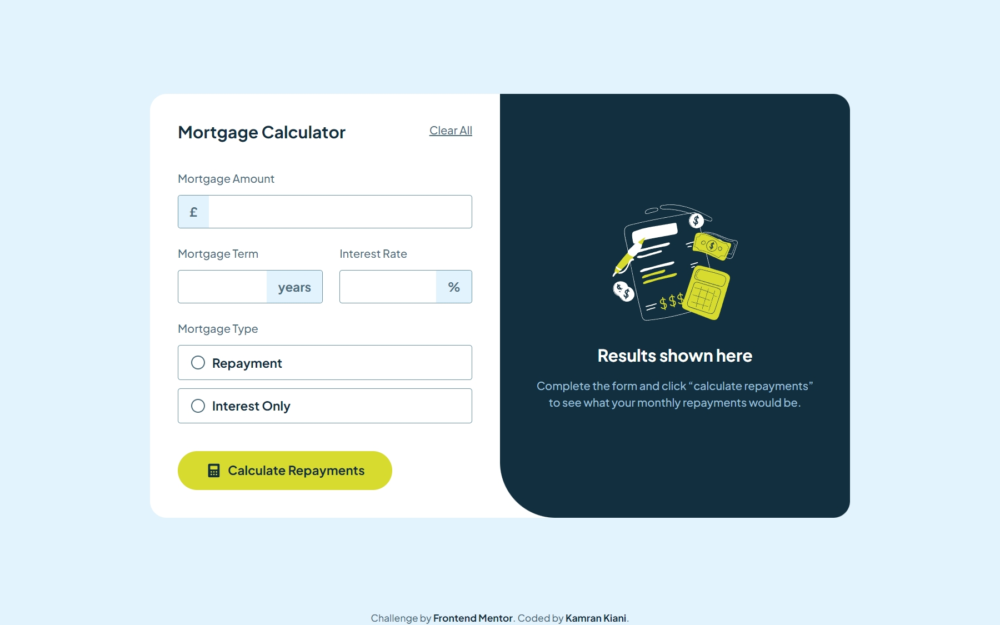

# Frontend Mentor - Mortgage repayment calculator solution

This is a solution to the [Mortgage repayment calculator challenge on Frontend Mentor](https://www.frontendmentor.io/challenges/mortgage-repayment-calculator-Galx1LXK73).

## Table of contents

- [Overview](#overview)
  - [The challenge](#the-challenge)
  - [Screenshot](#screenshot)
  - [Links](#links)
- [My process](#my-process)
  - [Built with](#built-with)
  - [What I learned](#what-i-learned)
- [Author](#author)
- [Acknowledgments](#acknowledgments)

## Overview

### The challenge

Users should be able to:

- Input mortgage information and see monthly repayment and total repayment amounts after submitting the form
- See form validation messages if any field is incomplete
- Complete the form only using their keyboard
- View the optimal layout for the interface depending on their device's screen size
- See hover and focus states for all interactive elements on the page

### Screenshot

### Links

- Solution URL: [GitHub Repository](https://github.com/kaamiikfm-mortgage-repayment-calculator-using-react-tailwind)
- Live Site URL: [Vercel Deployment](https://fm-mortgage-repayment-calculator-using-react-tailwind.vercel.app/)

## My process

### Built with

- Semantic HTML5 markup
- CSS custom properties
- Flexbox
- CSS Grid
- Tailwind CSS
- Mobile-first workflow
- [React](https://reactjs.org/) - JS library
- Forms
- Accessibility

### What I learned

Working on this challenge has been an insightful journey that deepened my understanding of React and reinforced my commitment to following the JS frameworks learning path. In this project, I:

- **Enhanced Form Handling in React:**  
  Built a project centered around forms to practice handling user input. I experimented with form submission, validation messages, and dynamic state updates, ensuring that the related components re-render correctly upon form submission.

- **Customized Component Implementation:**  
  Leveraged non-styled components from react-aria (including the number field and radio buttons) and applied my own styling. This not only improved the UI but also expanded my knowledge on how to integrate and modify third-party components.

- **Modular Component Design:**  
  Designed and implemented multiple reusable components such as:

  - **Button**
  - **Calculator Section** (which manages local state to handle re-renders)
  - **Result Section**
  - **Custom Number Field and Radio Button Components**

- **Utilized Tailwind CSS v4:**  
  Embraced Tailwind CSS, relying on its custom properties to craft unique styles that enhanced the project's look and feel. I truly enjoyed working with its utility-first approach.

Looking ahead, I plan to explore libraries like React Hook Form and Formik to streamline and further improve form management in future projects.

## Author

- Frontend Mentor - [@kaamiik](https://www.frontendmentor.io/profile/kaamiik)
- X - [@kiaakamran](https://www.x.com/kiaakamran)
